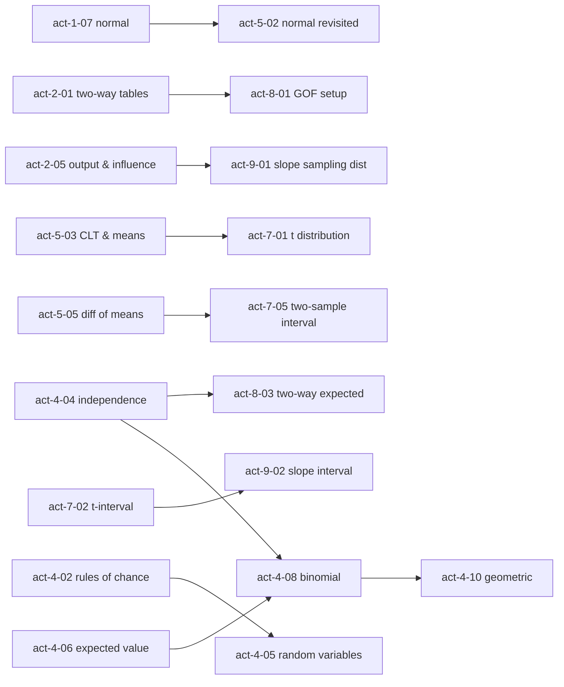

# DEAD RECKONING — Book One · Curriculum Map

Owner: Curriculum Architect. Binding for Act Teams (module ids, topics, prerequisites, instruments, calc placement, checkpoint blueprints). Working titles are ship-instrument flavored placeholders; the Story Architect / Showrunner finalize titles and beats in `docs/beat-sheet.md`, but **ids, topic codes, prerequisites and instruments do not move without a note to the Curriculum Architect**.

Companion: `docs/ap-coverage.md` (topic → module / checkpoint matrix).

---

## 0. Summary and time arithmetic

| Act | AP Unit (CED weight) | CED topics | Teaching modules | Checkpoint | Modules | Minutes |
|---|---|---|---|---|---|---|
| 0 Prologue | — | (seeds 1.1, 1.2, 1.3) | 3 | — | 3 | 60 |
| I Signatures | 1 · One-Variable Data (15–23%) | 10 | 7 | 20 | 8 | 205 |
| II Manifests | 2 · Two-Variable Data (5–7%) | 9 | 6 | 20 | 7 | 195 |
| III Testimony | 3 · Collecting Data (12–15%) | 7 | 5 | 20 | 6 | 165 |
| IV Running Cold | 4 · Probability & Distributions (10–20%) | 12 | 10 | 25 | 11 | 295 |
| V Noise Floor | 5 · Sampling Distributions (7–12%) | 8 | 5 | 20 | 6 | 160 |
| VI Accusation | 6 · Proportions (12–15%) | 11 | 8 | 25 | 9 | 245 |
| VII Halden Reach | 7 · Means (10–18%) | 10 | 7 | 25 | 8 | 225 |
| VIII Kettle | 8 · Chi-Square (2–5%) | 7 | 4 | 20 | 5 | 135 |
| IX Intent | 9 · Slopes (2–5%) | 6 | 4 | 25 | 5 | 140 |
| 10 Epilogue | — | (revisits 4.5, 6.7) | 2 | — | 2 | 40 |
| **Total** | 9 units | **80 topics** | **61** | **9 checkpoints · 200 min** | **70** | **1,865 min = 31.1 h** |

Arithmetic: teaching modules sum to 1,665 min (61 modules, mean 27.3 min, range 20–30); checkpoints sum to 200 min (9, range 20–25). 1,665 + 200 = 1,865 min = **31 h 05 min**, inside the 25–35 h contract with ~4 h of headroom either side. Per-Act minutes are listed in §2 and re-summed at the end of each Act block.

Module-count rationale: Unit 4 (12 topics, up to 20% of the exam) gets the most modules (10 + checkpoint). Units 6 and 7 (11 and 10 topics, the inference core) get 8 and 7. Units 8 and 9 (2–5% each) get 4 each, which is the minimum that still lets every topic own a module rather than a paragraph. Unit 2 is 5–7% of the exam but has 9 topics with a lot of hands-on content (regression, residuals, transformations) and is the spine of the manifest-fraud plot, so it gets 6.

---

## 1. Conventions used below

- **Ids** `act-N-NN` (two-digit NN), checkpoints `act-N-checkpoint`. Files `content/act-N/NN-slug.mdx`; checkpoints `content/act-N/checkpoint.mdx` (per CLAUDE.md). Prologue is `act-0`, epilogue `act-10`.
- **Skills** are the CED skill categories: **1** Selecting Statistical Methods · **2** Data Analysis · **3** Using Probability and Simulation · **4** Statistical Argumentation.
- **Rubric** column = the module carries at least one interpretation drill graded by the `InterpretationAnswer` rubric ("conclusion in context"). Marked **R**. Every module from Act II onward carries one except the four flagged **—** (pure probability computation modules, where the mission beat still demands a sentence in context but the drills are numeric).
- **Instruments**: names from build-order §8 are marked **[§8]**; instruments this map invents are marked **[new]**. Every §8 instrument is assigned to at least one module (index in §4).
- **Investigative use** follows the build-order §3 unit-to-plot mapping. It stays at the level of "what data, what question"; the Story Architect owns characters and specifics.
- **Every module** (including prologue/epilogue `module` kinds) follows the seven-beat contract: Scene → Briefing → Instrument → (Calc) → 4–8 drills → Mission beat → Log entry. `act-10-02` is the only `interlude`.
- Recurring datasets (the Story Architect should name them): **the Register** (corridor loss register: every ship lost on the corridor over ~6 years, with declared cause, owner, cargo category, tonnage, route, timestamp), **the Manifest file** (fuel burn, declared cargo mass, transit time per voyage), **the Crew Survey** (freighter crews' testimony), **the Sweep log** (own-ship sensor sweeps and detections), **the Refit set** (before/after reactor/transit data on refitted hulls).

---

## 2. Module plan

### Act 0 — Prologue · "Shakedown" (3 modules · 60 min)

| id | working title | topics | skills | prereqs | calc | min | rubric |
|---|---|---|---|---|---|---|---|
| act-0-01 | Shakedown | 1.1 | 2 | — | null | 20 | — |
| act-0-02 | Heat Budget | 1.2 | 1, 2 | act-0-01 | null | 20 | — |
| act-0-03 | Tasking | 1.1, 1.3 | 2 | act-0-02 | null | 20 | — |

**act-0-01 · Shakedown** — `content/act-0/01-shakedown.mdx` (replaces the pipeline placeholder; keep the id)
- Topics: 1.1 Introducing Statistics: What Can We Learn from Data? (seed; taught in full in act-1-01)
- Objectives: (a) Identify questions that data can answer and the role of variation in them. (b) Distinguish a population from a sample and a parameter from a statistic in the context of ship telemetry. (c) Summarize a small set of values with a mean and explain why a range is not a summary of center.
- Instrument: NAV fix-error dotplot with a re-run button (repeated six-fix runs) — a `<Plot>` plus `<MonteCarlo task="normal-sample-mean">`. **[new: nav fix-error display]**
- Investigative use: first shakedown data — dead-reckoning fix errors; establishes that the learner asks for numbers, not adjectives, and that the same procedure gives different numbers each run.
- Misconceptions: "variation means something is wrong"; "a range is a summary of center".

**act-0-02 · Heat Budget** — `content/act-0/02-heat-budget.mdx`
- Topics: 1.2 The Language of Variation: Variables
- Objectives: (a) Identify individuals and variables in a telemetry table. (b) Classify variables as categorical or quantitative, and quantitative variables as discrete or continuous. (c) Explain why the heat-sink capacity is the ship's governing resource and express it as a quantitative variable with units.
- Instrument: heat-sink capacity gauge — a `<Sim>` that runs the ship "cold" and drains sink capacity with run-to-run variation; the learner sets the cold window and watches margin. **[new: heat-sink gauge]** (Reused as the mission-cost display throughout Act IV.)
- Investigative use: establishes stealth as a budgeted resource with variability — the physical premise behind every Act IV expected-value problem.
- Misconceptions: "numbers are always quantitative" (hull numbers, cause codes); "continuous means it can be any number" vs discrete counts.

**act-0-03 · Tasking** — `content/act-0/03-tasking.mdx`
- Topics: 1.1 (population vs sample: the Register vs the corridor), 1.3 Representing a Categorical Variable with Tables (seed; taught in full in act-1-01)
- Objectives: (a) Read a frequency table and compute relative frequencies. (b) State what population the Register describes and what it does not. (c) Pose the mission question as a statistical question.
- Instrument: the Register — sortable/filterable table with a frequency-table panel that recomputes counts and relative frequencies on filter. **[new: register browser]**
- Investigative use: the official incident register arrives with the tasking order; the learner computes the share of losses coded "accident" and notes the population the register covers (one corridor, one reporting authority). Seeds the whole book's dataset.
- Misconceptions: "the register is the population" (it is a recorded sample of a reporting process); confusing count and proportion.

Act 0 subtotal: 20 + 20 + 20 = **60 min**.

---

### Act I — Unit 1 · Exploring One-Variable Data · "Signatures" (7 modules + checkpoint · 205 min)

| id | working title | topics | skills | prereqs | calc | min | rubric |
|---|---|---|---|---|---|---|---|
| act-1-01 | Register of Losses | 1.1, 1.2, 1.3 | 1, 2 | act-0-03 | null | 25 | — |
| act-1-02 | Cause Codes | 1.4 | 2, 4 | act-1-01 | null | 20 | R |
| act-1-03 | Drive Signatures | 1.5, 1.6 | 2, 4 | act-1-01 | null | 30 | R |
| act-1-04 | Center and Spread | 1.7 | 2, 4 | act-1-03 | null | 30 | R |
| act-1-05 | Five Numbers | 1.8 | 2 | act-1-04 | null | 25 | — |
| act-1-06 | Two Fleets | 1.9 | 2, 4 | act-1-05 | null | 25 | R |
| act-1-07 | The Normal Curve | 1.10 | 2, 3 | act-1-04 | area-under-a-curve | 30 | R |
| act-1-checkpoint | Checkpoint: Signatures | 1.1–1.10 | 1–4 | act-1-06, act-1-07 | null | 20 | R |

**act-1-01 · Register of Losses** — `content/act-1/01-register-of-losses.mdx`
- Topics: 1.1 Introducing Statistics: What Can We Learn from Data? · 1.2 The Language of Variation: Variables · 1.3 Representing a Categorical Variable with Tables
- Objectives: (a) Identify the individuals, variables and variable types in the Register. (b) Construct frequency and relative-frequency tables for a categorical variable. (c) Describe what the register can and cannot tell you about the corridor (population vs sample, parameter vs statistic).
- Instrument: register browser (from act-0-03) with a variable-inspector panel: click a column, classify it, see its table. **[new: variable inspector]**
- Investigative use: the Register's cause codes by frequency — the official story in one table; the learner notes how "unknown" is coded and how often.
- Misconceptions: coded numbers treated as quantitative; relative frequencies that don't sum to 1 because of a missing "other" row.

**act-1-02 · Cause Codes** — `content/act-1/02-cause-codes.mdx`
- Topics: 1.4 Representing a Categorical Variable with Graphs
- Objectives: (a) Construct and read bar charts (counts and relative frequencies) and, when appropriate, pie charts. (b) Identify how a graph's baseline, scale or area distorts the comparison. (c) Compare two categorical distributions with side-by-side bars in context.
- Instrument: misleading-display detector — a bar chart of cause codes with adjustable baseline, axis scale and bar width; a "restore honest axes" toggle. **[new: display-integrity panel]**
- Investigative use: the Admiralty's summary chart of classifications over all 2,200 Register records vs the same variable on losses only, on honest axes; "unknown" looks negligible (≈ 5% of all records) until the denominator is fixed (22 of 31 losses, 71%). See beat-sheet §5, decisions 3–4.
- Misconceptions: pie charts for non-part-of-whole data; reading a truncated axis as a proportional difference.

**act-1-03 · Drive Signatures** — `content/act-1/03-drive-signatures.mdx`
- Topics: 1.5 Representing a Quantitative Variable with Graphs · 1.6 Describing the Distribution of a Quantitative Variable
- Objectives: (a) Construct dotplots, stemplots and histograms of a quantitative variable and choose an appropriate bin width. (b) Describe a distribution's shape, center, variability and unusual features in context (SOCS). (c) Explain how bin width changes what a histogram shows.
- Instrument: dotplot/histogram builder with draggable points and a bin-width slider **[§8]**; stemplot view toggle.
- Investigative use: thermal-peak drive signatures logged by the corvette's passive sensors across dozens of freighter transits; one signature sits far off the cluster — a ship that should not be able to run that hot, or that cold.
- Misconceptions: "skewed left" read from where the peak is rather than where the tail is; treating a histogram as a bar chart (ordered vs unordered axis).

**act-1-04 · Center and Spread** — `content/act-1/04-center-and-spread.mdx`
- Topics: 1.7 Summary Statistics for a Quantitative Variable
- Objectives: (a) Calculate and interpret mean, median, range, IQR and standard deviation in context. (b) Explain which statistics are resistant to outliers and choose center/spread measures appropriate to the shape. (c) Interpret standard deviation as typical distance from the mean, in units.
- Instrument: outlier and skew explorer — drag one point out of the cluster and watch mean vs median and SD vs IQR diverge live. **[§8]**
- Investigative use: the outlier signature pulls the fleet mean; the learner decides whether to report the mean or median signature and quantifies how much one ship distorts the summary.
- Misconceptions: "SD is the average deviation"; "the median is the middle value on the graph"; dividing by n instead of n − 1 (state the convention once).

**act-1-05 · Five Numbers** — `content/act-1/05-five-numbers.mdx`
- Topics: 1.8 Graphical Representations of Summary Statistics
- Objectives: (a) Compute the five-number summary and construct a boxplot (modified, with outliers marked). (b) Apply the 1.5 × IQR rule to identify outliers. (c) Read shape and variability from a boxplot and explain what a boxplot hides (modes, gaps).
- Instrument: boxplot builder with draggable points and live fences **[§8]** (same component family as act-1-03).
- Investigative use: the 1.5 × IQR fence formally flags the anomalous signature; the learner logs it as an outlier and asks for the hull id — the first thread.
- Misconceptions: "the box holds 50% of the range"; equating box width with sample size.

**act-1-06 · Two Fleets** — `content/act-1/06-two-fleets.mdx`
- Topics: 1.9 Comparing Distributions of a Quantitative Variable
- Objectives: (a) Compare two or more distributions using parallel boxplots, back-to-back stemplots or comparative histograms. (b) Write a comparison that addresses shape, center, variability and unusual features in context with comparative language. (c) Choose the display that best supports a stated comparison.
- Instrument: comparative distribution display — parallel boxplots / back-to-back stemplot / overlaid histograms of two groups with a group-selector. **[new: comparative display]**
- Investigative use: signatures of ships that completed the corridor vs ships later lost — the learner writes the first formal comparison; the lost ships' distribution is shifted and tighter than it should be.
- Misconceptions: describing each distribution separately instead of comparing; "bigger box = more data".

**act-1-07 · The Normal Curve** — `content/act-1/07-the-normal-curve.mdx`
- Topics: 1.10 The Normal Distribution (includes z-scores, percentiles, effects of linear transformations, empirical rule, normal-model areas)
- Objectives: (a) Compute and interpret z-scores and percentiles as measures of relative position. (b) Describe the effect of adding/multiplying a constant on center, spread and shape. (c) Use the empirical rule and the normal model to find proportions above/below/between values and to find a value from a proportion.
- Instrument: z-score / normal-area explorer — drag cutoffs, shade, read area; unit-conversion toggle to show transformation effects. **[§8]**
- Calc: `area-under-a-curve`
- Investigative use: under the fleet's normal model of drive signatures, the learner computes how rare the outlier hull's signature is (a z beyond 3) — rare enough that "bad luck" is not a serious explanation.
- Misconceptions: "z-scores only work for normal data"; "the empirical rule applies to every distribution"; reading a density height as a probability.

**act-1-checkpoint · Checkpoint: Signatures** — `content/act-1/checkpoint.mdx` — 20 min — blueprint in §5.

Act I subtotal: 25 + 20 + 30 + 30 + 25 + 25 + 30 + 20 = **205 min**.

---

### Act II — Unit 2 · Exploring Two-Variable Data · "Manifests" (6 modules + checkpoint · 195 min)

| id | working title | topics | skills | prereqs | calc | min | rubric |
|---|---|---|---|---|---|---|---|
| act-2-01 | Cross-Tabulation | 2.1, 2.2, 2.3 | 2, 4 | act-1-checkpoint | null | 30 | R |
| act-2-02 | Burn vs Mass | 2.4, 2.5 | 2, 4 | act-2-01 | null | 30 | R |
| act-2-03 | Line of Best Fit | 2.6, 2.8 | 2, 4 | act-2-02 | minimizing-squared-error | 30 | R |
| act-2-04 | Residuals | 2.7 | 2, 4 | act-2-03 | null | 30 | R |
| act-2-05 | Leverage | 2.8 | 2, 4 | act-2-04 | null | 25 | R |
| act-2-06 | Curvature | 2.9 | 1, 2, 4 | act-2-05 | logs-and-linearization | 30 | R |
| act-2-checkpoint | Checkpoint: Manifests | 2.1–2.9 | 1–4 | act-2-06 | null | 20 | R |

**act-2-01 · Cross-Tabulation** — `content/act-2/01-cross-tabulation.mdx`
- Topics: 2.1 Introducing Statistics: Are Variables Related? · 2.2 Representing Two Categorical Variables · 2.3 Statistics for Two Categorical Variables
- Objectives: (a) Construct two-way tables and side-by-side, segmented and mosaic bar graphs. (b) Calculate joint, marginal and conditional relative frequencies. (c) Describe whether two categorical variables appear associated, using conditional distributions, in context.
- Instrument: two-way table explorer with segmented-bar and mosaic views; toggle row/column conditioning. **[new: two-way table explorer]**
- Investigative use: the Register cross-tabulated — declared cause × owner. Conditional distributions differ by owner; "accident" is the modal cause for one owner far more than for the others. This is descriptive only; the formal test waits for Act VIII.
- Misconceptions: comparing counts instead of conditional proportions when group sizes differ; conditioning on the wrong variable.

**act-2-02 · Burn vs Mass** — `content/act-2/02-burn-vs-mass.mdx`
- Topics: 2.4 Representing the Relationship Between Two Quantitative Variables · 2.5 Correlation
- Objectives: (a) Construct and describe a scatterplot (direction, form, strength, unusual features) in context. (b) Calculate and interpret the correlation r and state its properties (unitless, symmetric, sensitive to outliers, linear only). (c) Explain why correlation does not imply causation.
- Instrument: scatterplot with draggable points and live r **[§8]** (the regression line is unlocked in the next module).
- Investigative use: the Manifest file — fuel burn vs declared cargo mass across voyages. Physics says a strong positive linear relationship; the learner sees it, and sees a few voyages that burned far more than their declared mass warrants.
- Misconceptions: correlation implies causation; r = 0 means "no relationship"; r changes with units; strong r means linear.

**act-2-03 · Line of Best Fit** — `content/act-2/03-line-of-best-fit.mdx`
- Topics: 2.6 Linear Regression Models · 2.8 Least Squares Regression (the least-squares principle, b = r·sy/sx, a = ȳ − b·x̄, line through (x̄, ȳ))
- Objectives: (a) Determine the least-squares regression line and use it to predict a response. (b) Interpret slope and y-intercept in context. (c) Explain why extrapolation is unreliable and why "least squares" is the criterion.
- Instrument: least-squares "minimize the squares" visual — drag a candidate line, watch the squared residuals as areas and the total; snap to the LSRL. **[§8]**
- Calc: `minimizing-squared-error`
- Investigative use: the learner fits burn on declared mass and interprets the slope as fuel per tonne — a number the chief engineer can check against the ship class's specs. The intercept has a physical meaning (empty-hull burn) that will be checked in Act VII.
- Misconceptions: interpreting the slope without "predicted" and "on average"; interpreting an intercept outside the data range as physical; swapping x and y.

**act-2-04 · Residuals** — `content/act-2/04-residuals.mdx`
- Topics: 2.7 Residuals
- Objectives: (a) Calculate and interpret a residual in context. (b) Construct a residual plot and use it to judge whether a linear model is appropriate. (c) Identify systematic patterns (curvature, fanning) and what they imply.
- Instrument: scatterplot with live regression line and linked residual plot **[§8]** — hover a point to see its residual on both panels.
- Investigative use: burn residuals by voyage. Most scatter around zero; a set of voyages by one owner sits consistently positive — they burned as if they carried more than the manifest says. Falsified manifests, in a plot.
- Misconceptions: residual = predicted − actual (sign); "a residual plot with a pattern means the data are wrong" (it means the model is wrong).

**act-2-05 · Leverage** — `content/act-2/05-leverage.mdx`
- Topics: 2.8 Least Squares Regression (r², standard deviation of the residuals s, computer output, outliers, high-leverage and influential points)
- Objectives: (a) Interpret r² and s in context. (b) Read a regression computer-output table (coefficients, SE, r², s) and write the equation. (c) Explain how outliers, high-leverage points and influential points affect the line, r and r².
- Instrument: leverage/influence explorer — drag a single point through the x-range and watch slope, r² and s respond; toggle "with/without" comparison. **[new: influence explorer]** (Extension of the §8 scatterplot.)
- Investigative use: one extreme voyage drags the whole fit; the learner decides whether to fit with or without it and reads a computer-output table for the first time — the same table the Admiralty's report quotes selectively.
- Misconceptions: "r² is the correlation"; "s is the SD of y"; deleting an inconvenient point without justification.

**act-2-06 · Curvature** — `content/act-2/06-curvature.mdx`
- Topics: 2.9 Analyzing Departures from Linearity
- Objectives: (a) Recognize non-linear patterns and apply logarithmic/power transformations to achieve linearity. (b) Compare candidate models using residual plots and r². (c) Interpret a model fitted on transformed variables and back-transform a prediction.
- Instrument: transformation toggler — raw / log y / log x / log-log with linked residual plot and r². **[new: transformation console]**
- Calc: `logs-and-linearization`
- Investigative use: transit time vs distance across the corridor follows a physical power law; on a log-log plot it linearizes, and one ship class's transits sit off the line: they took a route the manifest does not declare.
- Misconceptions: "fit a line, r² is high, done" without a residual plot; interpreting a log-model slope as raw units.

**act-2-checkpoint · Checkpoint: Manifests** — `content/act-2/checkpoint.mdx` — 20 min — blueprint in §5.

Act II subtotal: 30 + 30 + 30 + 30 + 25 + 30 + 20 = **195 min**.

---

### Act III — Unit 3 · Collecting Data · "Testimony" (5 modules + checkpoint · 165 min)

| id | working title | topics | skills | prereqs | calc | min | rubric |
|---|---|---|---|---|---|---|---|
| act-3-01 | Who Was Asked | 3.1, 3.2 | 1, 4 | act-2-checkpoint | null | 25 | R |
| act-3-02 | Drawing the Sample | 3.3 | 1, 3 | act-3-01 | null | 30 | R |
| act-3-03 | Bias | 3.4 | 1, 3, 4 | act-3-02 | null | 30 | R |
| act-3-04 | The Admiralty's Trial | 3.5, 3.6 | 1, 4 | act-3-03 | null | 30 | R |
| act-3-05 | What a Trial Can Say | 3.7 | 3, 4 | act-3-04 | null | 30 | R |
| act-3-checkpoint | Checkpoint: Testimony | 3.1–3.7 | 1–4 | act-3-05 | null | 20 | R |

**act-3-01 · Who Was Asked** — `content/act-3/01-who-was-asked.mdx`
- Topics: 3.1 Introducing Statistics: Do the Data We Collected Tell the Truth? · 3.2 Introduction to Planning a Study
- Objectives: (a) Identify the population, sample, and sampling frame of a study. (b) Distinguish a sample survey, an observational study and an experiment, and state the scope of conclusions each supports. (c) Explain why the Register's testimony cannot be generalized to the corridor's crews.
- Instrument: survey-frame explorer — a fleet population map; highlight the frame, the sample, and who is unreachable (docked, in transit, lost). **[new: frame explorer]**
- Investigative use: the official incident reports include crew statements only from crews who reached port and chose to file. The learner frames the question the Crew Survey must answer and who must be in the frame.
- Misconceptions: "a big sample fixes a bad frame"; observational study vs experiment confused by the presence of "groups".

**act-3-02 · Drawing the Sample** — `content/act-3/02-drawing-the-sample.mdx`
- Topics: 3.3 Random Sampling and Data Collection
- Objectives: (a) Implement a simple random sample, and stratified, cluster and systematic samples, using random numbers. (b) Explain the strengths and weaknesses of each method for a stated goal. (c) Distinguish stratified from cluster sampling by what varies within and between groups.
- Instrument: sampling-method simulator on a fleet population (SRS / stratified by owner / cluster by convoy / systematic by hull number) with the sample's estimate compared to the fleet truth over repeated draws. **[§8]**
- Investigative use: designing the Crew Survey: stratify by owner so the suspect owner's crews are represented; cluster by convoy to save transit time; the learner sees why cluster sampling is cheaper and noisier.
- Misconceptions: "stratified = split into groups" (must sample from every stratum); "random = haphazard".

**act-3-03 · Bias** — `content/act-3/03-bias.mdx`
- Topics: 3.4 Potential Problems with Sampling
- Objectives: (a) Identify undercoverage, nonresponse, voluntary response, convenience sampling and response bias (wording, interviewer, self-report) in a described study. (b) Predict the direction of bias in context. (c) Distinguish bias (systematic) from sampling variability (random) using a simulated sampling distribution.
- Instrument: bias demonstrator — choose a selection mechanism (docked crews only, volunteers, leading wording) and watch the distribution of the sample estimate shift away from the truth while random SRS scatters around it. **[§8]**
- Investigative use: the Admiralty's crew statements are voluntary-response and worded to prompt "accident"; the learner estimates the direction and shows the Register's cause proportions are biased, not merely noisy.
- Misconceptions: "bias is fixed by a larger n"; sampling variability called bias; "random sample means no bias of any kind" (response bias survives random selection).

**act-3-04 · The Admiralty's Trial** — `content/act-3/04-the-admiraltys-trial.mdx`
- Topics: 3.5 Introduction to Experimental Design · 3.6 Selecting an Experimental Design
- Objectives: (a) Identify experimental units, treatments, factors, levels, and the response variable. (b) Explain the roles of comparison, random assignment, control, replication and blinding, and identify confounding. (c) Select and justify a completely randomized, randomized block or matched-pairs design for a stated question.
- Instrument: design builder / random-assignment simulator — drag hulls into treatment groups, block by owner or route, press randomize; a confounding indicator shows how unbalanced the groups are on a lurking variable. **[new: design builder]**
- Investigative use: the Admiralty's escort "trial": escorts were assigned to convoys by owner request, not at random; loss rate with escorts looked lower. The learner rebuilds the design and shows owner is confounded with escort.
- Misconceptions: "random sampling and random assignment are the same thing"; "a control group is a group that isn't treated" (it can be a standard treatment); blocking by the response.

**act-3-05 · What a Trial Can Say** — `content/act-3/05-what-a-trial-can-say.mdx`
- Topics: 3.7 Inference and Experiments
- Objectives: (a) Explain how random assignment supports causal conclusions and random sampling supports generalization. (b) Use a simulated randomization distribution to judge whether an observed difference is statistically significant. (c) State the scope of inference of a study in context.
- Instrument: randomization test machine — re-shuffle treatment labels, build the distribution of group differences, locate the observed difference. **[§8 bootstrap/randomization test machine — randomization mode]**
- Investigative use: with the Crew Survey and one honestly randomized escort assignment (a small trial the learner ordered on their own authority), the learner asks whether the observed difference is larger than chance assignment alone produces. It is not — which means escorts are not the explanation and something else is.
- Misconceptions: "statistically significant = important"; "a difference exists, so it's real"; causal claims from observational data.

**act-3-checkpoint · Checkpoint: Testimony** — `content/act-3/checkpoint.mdx` — 20 min — blueprint in §5.

Act III subtotal: 25 + 30 + 30 + 30 + 30 + 20 = **165 min**.

---

### Act IV — Unit 4 · Probability, Random Variables & Probability Distributions · "Running Cold" (10 modules + checkpoint · 295 min)

| id | working title | topics | skills | prereqs | calc | min | rubric |
|---|---|---|---|---|---|---|---|
| act-4-01 | Random or Not | 4.1, 4.2 | 3, 4 | act-3-checkpoint | null | 25 | R |
| act-4-02 | Rules of Chance | 4.3, 4.4 | 3 | act-4-01 | null | 25 | — |
| act-4-03 | Given That | 4.5 | 3, 4 | act-4-02 | null | 30 | R |
| act-4-04 | Independence | 4.6 | 3, 4 | act-4-03 | null | 25 | R |
| act-4-05 | Distribution of a Cold Run | 4.7 | 3 | act-4-02 | density-vs-mass | 25 | — |
| act-4-06 | The Heat Ledger | 4.8 | 3, 4 | act-4-05 | expected-value-as-weighted-sum | 30 | R |
| act-4-07 | Combining Systems | 4.9 | 3, 4 | act-4-06 | null | 30 | R |
| act-4-08 | Pings | 4.10 | 3 | act-4-04, act-4-06 | null | 30 | — |
| act-4-09 | Binomial Parameters | 4.11 | 3, 4 | act-4-08 | null | 25 | R |
| act-4-10 | Until First Contact | 4.12 | 3, 4 | act-4-08 | geometric-series | 25 | R |
| act-4-checkpoint | Checkpoint: Running Cold | 4.1–4.12 | 1–4 | act-4-07, act-4-09, act-4-10 | null | 25 | R |

**act-4-01 · Random or Not** — `content/act-4/01-random-or-not.mdx`
- Topics: 4.1 Introducing Statistics: Random and Non-Random Patterns? · 4.2 Estimating Probabilities Using Simulation
- Objectives: (a) Describe what "random" means in the long run (law of large numbers) and why short runs show streaks. (b) Design and carry out a simulation to estimate a probability, stating the model, one trial, and the statistic. (c) Interpret a simulated probability in context.
- Instrument: clustering simulator — simulate loss times as uniform over the period, compute the largest cluster in any 30-day window, build its distribution, compare to the Register's actual cluster. **[new: clustering simulator]**
- Investigative use: losses on the Register cluster in time. The learner simulates random loss times and finds the observed cluster is unusual under randomness — the first quantitative statement that the losses are not "bad luck".
- Misconceptions: gambler's fallacy; "random means evenly spread"; a simulated estimate reported as exact.

**act-4-02 · Rules of Chance** — `content/act-4/02-rules-of-chance.mdx`
- Topics: 4.3 Introduction to Probability · 4.4 Mutually Exclusive Events
- Objectives: (a) Define sample space, event, and probability as long-run relative frequency; apply the complement rule. (b) Identify mutually exclusive events and apply the addition rule for them. (c) Compute probabilities from a two-way table or Venn diagram.
- Instrument: sample-space / Venn area explorer — events drawn as areas on the sweep log's outcome space; drag to overlap or separate; P(A ∪ B) reads live. **[new: event-space panel]**
- Investigative use: the sweep log — probability that an enemy sweep detects the corvette during a given window; complement of "no detection"; mutually exclusive detection modes (thermal vs radar).
- Misconceptions: "mutually exclusive" and "independent" swapped; P(A or B) = P(A) + P(B) always.

**act-4-03 · Given That** — `content/act-4/03-given-that.mdx`
- Topics: 4.5 Conditional Probability
- Objectives: (a) Calculate and interpret conditional probabilities from a two-way table and from a tree diagram. (b) Apply the general multiplication rule P(A ∩ B) = P(A)·P(B|A). (c) Reverse a conditioning using a tree (P(B|A) from P(A|B)) and explain the difference in context.
- Instrument: probability tree builder — build branches, enter probabilities, read joint and reversed conditionals; live check that branches sum to 1. **[§8]**
- Investigative use: P(detected | running cold) vs P(detected | running warm) from the sweep log; and, from the Register, P(cause coded "accident" | owner) vs P(owner | cause coded "accident") — the learner shows the Admiralty quoted the wrong conditional.
- Misconceptions: P(A|B) = P(B|A) (the prosecutor's fallacy); conditioning on the wrong total.

**act-4-04 · Independence** — `content/act-4/04-independence.mdx`
- Topics: 4.6 Independent Events and Unions of Events
- Objectives: (a) Determine whether two events are independent using P(A|B) = P(A) or P(A ∩ B) = P(A)·P(B). (b) Apply the multiplication rule for independent events and the general addition rule. (c) Explain in context what independence would mean and why it might fail.
- Instrument: independence checker — a two-way table with conditional vs marginal comparison bars; edit cells to make the variables independent. **[new: independence checker]**
- Investigative use: are consecutive sweeps independent (they are not — a detection triggers a focused re-sweep), and are losses independent of owner (the conditional probability of loss given owner differs from the marginal). Descriptive precursor to the Act VIII chi-square test.
- Misconceptions: "independent = mutually exclusive"; multiplying probabilities of dependent events; "we found P(A|B) ≠ P(A) in a sample so they are dependent in the population" (the inference comes in Act VIII).

**act-4-05 · Distribution of a Cold Run** — `content/act-4/05-distribution-of-a-cold-run.mdx`
- Topics: 4.7 Introduction to Random Variables and Probability Distributions
- Objectives: (a) Define a discrete random variable and represent its probability distribution as a table or histogram. (b) Compute P(X = k), P(X ≤ k), P(X > k) and interpret in context. (c) Distinguish discrete from continuous random variables and describe probability for a continuous variable as area under a density.
- Instrument: heat-budget distribution editor — an editable pmf for "hours of cold running required before the next hide-window" with cumulative view; continuous-density mode for sink temperature. **[new: distribution editor]**
- Calc: `density-vs-mass`
- Investigative use: the number of hours the corvette must stay cold to cross a patrol sweep is a random variable; the learner builds its distribution from the sweep log and asks P(X > sink capacity).
- Misconceptions: a probability distribution that does not sum to 1; P(X ≥ k) vs P(X > k) off-by-one; "P(X = x) for a continuous X".

**act-4-06 · The Heat Ledger** — `content/act-4/06-the-heat-ledger.mdx`
- Topics: 4.8 Mean and Standard Deviation of Random Variables
- Objectives: (a) Calculate and interpret the mean (expected value) of a discrete random variable in context. (b) Calculate and interpret the standard deviation of a discrete random variable. (c) Use expected value to compare decisions with uncertain outcomes and explain what "expected" does and does not promise.
- Instrument: heat-budget expected-value planner — the distribution editor with live E[X], SD, and a "patrol option" comparator (two candidate routes, their heat-cost distributions, expected cost and risk of exceeding capacity). **[new: expected-value planner]**
- Calc: `expected-value-as-weighted-sum`
- Investigative use: choosing where to patrol: an inner route with lower expected heat cost but a fat tail, or an outer route with higher expected cost but a tight distribution. The learner decides, and the story goes where the numbers point.
- Misconceptions: "expected value is the most likely outcome"; SD of a random variable computed as the SD of its possible values (ignoring probabilities).

**act-4-07 · Combining Systems** — `content/act-4/07-combining-systems.mdx`
- Topics: 4.9 Combining Random Variables
- Objectives: (a) Calculate the mean and SD of a linear transformation aX + b of a random variable. (b) Calculate the mean and SD of sums and differences of independent random variables (variances add; SDs do not). (c) Explain why independence is required for the variance rule and what changes for a difference.
- Instrument: random-variable combiner — two independent heat-load distributions (reactor, life-support), drag their means/SDs, watch the sum's distribution form and its SD compare to the "naive" sum of SDs. **[§8]**
- Investigative use: the chief's margin: total heat load is the sum of independent system loads; the learner computes the total's SD correctly (√Σσ²) and shows why the yard's quoted margin (treating the six load errors as averaging out) was too generous and the analyst's (adding SDs) too pessimistic.
- Misconceptions: SDs add; variance of a difference subtracts; forgetting the multiplier squares in the variance.

**act-4-08 · Pings** — `content/act-4/08-pings.mdx`
- Topics: 4.10 Introduction to the Binomial Distribution
- Objectives: (a) Determine whether a setting is binomial (binary, independent, fixed n, same p). (b) Calculate binomial probabilities P(X = k) and cumulative probabilities. (c) Interpret a binomial probability in context.
- Instrument: binomial explorer — n and p sliders, pmf bars, click-to-shade cumulative regions. **[§8 binomial explorer]**
- Investigative use: n independent enemy sweeps in a transit, each detecting the corvette with probability p — the number of detections is binomial; the learner computes P(0 detections) for a planned cold crossing.
- Misconceptions: treating sampling without replacement as binomial without checking the 10% condition; P(X ≤ k) vs P(X < k).

**act-4-09 · Binomial Parameters** — `content/act-4/09-binomial-parameters.mdx`
- Topics: 4.11 Parameters for a Binomial Distribution
- Objectives: (a) Calculate and interpret the mean and SD of a binomial random variable. (b) Describe the shape of a binomial distribution and how it depends on n and p. (c) Use the binomial distribution to judge whether an observed count is surprising under a stated p.
- Instrument: binomial explorer with mean ± 2 SD overlay and a "where does the observed count sit" marker. **[§8 binomial explorer, parameters mode]**
- Investigative use: with the Register's stated baseline loss rate p and the corridor's n transits, the learner asks whether the observed number of losses is surprising — the pre-inference version of Act VI's test.
- Misconceptions: "np is the SD"; declaring surprise from a single probability P(X = k) instead of a tail.

**act-4-10 · Until First Contact** — `content/act-4/10-until-first-contact.mdx`
- Topics: 4.12 The Geometric Distribution
- Objectives: (a) Determine whether a setting is geometric and calculate P(X = k) for the number of trials to the first success. (b) Calculate and interpret the mean and SD of a geometric random variable. (c) Compare the geometric and binomial settings and choose the right one for a question.
- Instrument: geometric explorer — p slider, pmf, cumulative "by trial k" shading; expected trials marker. **[§8 geometric explorer]**
- Calc: `geometric-series`
- Investigative use: how many sweeps until the first detection — equivalently, how long the corvette can expect to stay hidden; the learner sets the cold window to a chosen tail probability.
- Misconceptions: "the mean 1/p is the most likely value"; geometric pmf indexed from 0 vs 1 (state the AP convention: trials until and including first success).

**act-4-checkpoint · Checkpoint: Running Cold** — `content/act-4/checkpoint.mdx` — 25 min — blueprint in §5.

Act IV subtotal: 25 + 25 + 30 + 25 + 25 + 30 + 30 + 30 + 25 + 25 + 25 = **295 min**.

---

### Act V — Unit 5 · Sampling Distributions · "Noise Floor" (5 modules + checkpoint · 160 min)

| id | working title | topics | skills | prereqs | calc | min | rubric |
|---|---|---|---|---|---|---|---|
| act-5-01 | Why the Reports Disagree | 5.1, 5.4 | 3, 4 | act-4-checkpoint | null | 30 | R |
| act-5-02 | Normal, Revisited | 5.2 | 3 | act-1-07, act-5-01 | integral-as-accumulation | 25 | R |
| act-5-03 | The Machine | 5.3, 5.7 | 3, 4 | act-5-02 | limits-and-the-clt | 30 | R |
| act-5-04 | Proportions in the Noise | 5.5, 5.6 | 3, 4 | act-5-03 | null | 30 | R |
| act-5-05 | Differences in Means | 5.8 | 3, 4 | act-5-03 | null | 25 | R |
| act-5-checkpoint | Checkpoint: Noise Floor | 5.1–5.8 | 1–4 | act-5-04, act-5-05 | null | 20 | R |

**act-5-01 · Why the Reports Disagree** — `content/act-5/01-why-the-reports-disagree.mdx`
- Topics: 5.1 Introducing Statistics: Why Is My Sample Not Like Yours? · 5.4 Biased and Unbiased Point Estimates
- Objectives: (a) Distinguish a parameter from a statistic and describe a sampling distribution as the distribution of a statistic over all samples of size n. (b) Identify whether an estimator is unbiased from a simulated sampling distribution, and describe how variability changes with n. (c) Explain in context why two honest patrol reports differ.
- Instrument: sampling-distribution builder — draw repeated samples of patrol reports from the corridor population; stack the statistic (mean, median, max, range) and compare its center to the truth. **[new: sampling-distribution builder]** (Precursor of the CLT machine.)
- Investigative use: three patrol reports give three different corridor loss estimates; the learner shows how much disagreement honest sampling produces and that the Admiralty's preferred statistic (a maximum-based one) is biased.
- Misconceptions: "the sampling distribution is the distribution of the sample"; "bias" used for random error; "larger n reduces bias".

**act-5-02 · Normal, Revisited** — `content/act-5/02-normal-revisited.mdx`
- Topics: 5.2 The Normal Distribution, Revisited
- Objectives: (a) Calculate probabilities and percentiles for a normal distribution with given parameters, in both directions. (b) Assess whether a normal model is reasonable for a distribution (dotplot/histogram/normal probability plot). (c) Interpret a normal-model probability in context as a long-run proportion.
- Instrument: z-score / normal-area explorer in inverse mode (enter an area, read the cutoff) with a normal-probability-plot side panel. **[§8, reused]**
- Calc: `integral-as-accumulation`
- Investigative use: the corridor's Mark-9 delay distribution is well modeled as normal; the learner finds the 1% cutoff and shows that no single suspect hull is individually remarkable (about one honest transit in seven is that late) — the evidence is in the mean, which is act-5-03's job. See beat-sheet §5, decision 7.
- Misconceptions: "the CLT makes the population normal"; using the normal model on a clearly skewed variable without saying so.

**act-5-03 · The Machine** — `content/act-5/03-the-machine.mdx`
- Topics: 5.3 The Central Limit Theorem · 5.7 Sampling Distributions for Sample Means
- Objectives: (a) State the mean and SD of the sampling distribution of x̄ (μ, σ/√n) and the conditions for approximate normality (normal population or n ≥ 30). (b) Explain the Central Limit Theorem and what it does and does not say. (c) Calculate probabilities about a sample mean and interpret them in context.
- Instrument: Central Limit Theorem machine — pick any parent (skewed transit times, uniform, bimodal, Bernoulli), set n, watch the sampling distribution of x̄ form live with its SD shrinking as σ/√n. **[§8]**
- Calc: `limits-and-the-clt`
- Investigative use: the "normal" variation in mean transit time across patrol samples — the learner computes how far a sample mean can honestly stray and finds the suspect owner's mean transit time is outside it.
- Misconceptions: "the CLT makes the population normal"; "n ≥ 30 makes anything normal" (it is about x̄); σ/n instead of σ/√n.

**act-5-04 · Proportions in the Noise** — `content/act-5/04-proportions-in-the-noise.mdx`
- Topics: 5.5 Sampling Distributions for Sample Proportions · 5.6 Sampling Distributions for Differences in Sample Proportions
- Objectives: (a) State the mean and SD of the sampling distribution of p̂ and check the large-counts condition (np ≥ 10, n(1 − p) ≥ 10) and the 10% condition. (b) State the mean and SD of p̂1 − p̂2 and its conditions. (c) Calculate and interpret probabilities about a sample proportion or a difference in sample proportions in context.
- Instrument: proportion sampling simulator — one or two corridor populations with true loss rates; draw samples of n transits; stack p̂ or p̂1 − p̂2; overlay the normal model when conditions hold. **[new: proportion sampler]** (CLT machine, Bernoulli mode, two-population.)
- Investigative use: how much the corridor's sample loss proportion can vary by chance around the baseline; and how much two corridors' loss proportions can differ by chance alone — the null model for Act VI.
- Misconceptions: using p̂ in place of p in the SD when p is known; forgetting the 10% condition when sampling without replacement; "difference of proportions has SD equal to the difference of SDs".

**act-5-05 · Differences in Means** — `content/act-5/05-differences-in-means.mdx`
- Topics: 5.8 Sampling Distributions for Differences in Sample Means
- Objectives: (a) State the mean and SD of the sampling distribution of x̄1 − x̄2 and the conditions for approximate normality. (b) Calculate and interpret a probability about a difference in sample means. (c) Explain why the variance of a difference adds.
- Instrument: two-population CLT machine — two parents, two n, the difference distribution forming live; compare its SD to √(σ1²/n1 + σ2²/n2). **[§8 CLT machine, difference mode]**
- Investigative use: how far the mean transit time of refitted ships could honestly differ from unrefitted ones — the null model for Act VII's two-sample test.
- Misconceptions: SD of a difference subtracts; pooling variances without justification.

**act-5-checkpoint · Checkpoint: Noise Floor** — `content/act-5/checkpoint.mdx` — 20 min — blueprint in §5.

Act V subtotal: 30 + 25 + 30 + 30 + 25 + 20 = **160 min**.

---

### Act VI — Unit 6 · Inference for Categorical Data: Proportions · "Accusation" (8 modules + checkpoint · 245 min)

| id | working title | topics | skills | prereqs | calc | min | rubric |
|---|---|---|---|---|---|---|---|
| act-6-01 | Capture | 6.1, 6.2 | 3, 4 | act-5-checkpoint | tails-and-inverse-functions | 30 | R |
| act-6-02 | Margin | 6.2, 6.3 | 1, 3, 4 | act-6-01 | null | 30 | R |
| act-6-03 | The Hypothesis | 6.4 | 1, 4 | act-6-02 | null | 25 | R |
| act-6-04 | What the p-Value Means | 6.5 | 3, 4 | act-6-03 | null | 25 | R |
| act-6-05 | Conclusion | 6.6 | 4 | act-6-04 | null | 25 | R |
| act-6-06 | Errors and Power | 6.7 | 3, 4 | act-6-05 | null | 30 | R |
| act-6-07 | Two Corridors | 6.8, 6.9 | 1, 3, 4 | act-6-05 | null | 25 | R |
| act-6-08 | The Accusation | 6.10, 6.11 | 1, 3, 4 | act-6-06, act-6-07 | null | 30 | R |
| act-6-checkpoint | Checkpoint: Accusation | 6.1–6.11 | 1–4 | act-6-08 | null | 25 | R |

**act-6-01 · Capture** — `content/act-6/01-capture.mdx`
- Topics: 6.1 Introducing Statistics: Why Be Normal? · 6.2 Constructing a Confidence Interval for a Population Proportion (logic, conditions, critical values)
- Objectives: (a) Explain the logic of a confidence interval as statistic ± margin of error, where the margin comes from the sampling distribution. (b) Verify the conditions for a one-sample z-interval for a proportion (random, 10%, large counts using p̂). (c) Interpret the confidence level as a long-run capture rate, not a probability about one interval.
- Instrument: confidence-interval capture simulator — 100 intervals from repeated samples, the truth as a vertical line, capture count updating; C and n sliders. **[§8]**
- Calc: `tails-and-inverse-functions`
- Investigative use: the learner needs to report the corridor's loss rate with an honest margin; the capture simulator shows what "95% confident" commits you to, before any number is reported up the chain.
- Misconceptions: "95% probability the parameter is in this interval"; "95% of the data lie in the interval"; "a wider interval is more confident about a narrower thing".

**act-6-02 · Margin** — `content/act-6/02-margin.mdx`
- Topics: 6.2 Constructing a Confidence Interval for a Population Proportion (computation) · 6.3 Justifying a Claim Based on a Confidence Interval for a Population Proportion
- Objectives: (a) Construct a one-sample z-interval for a proportion and interpret it in context. (b) Describe how the margin of error changes with n and confidence level, and find the n needed for a target margin. (c) Use an interval to justify or reject a claim about the parameter.
- Instrument: margin-of-error planner — n and C sliders, live interval on a number line against the Admiralty's baseline claim; sample-size solver. **[new: margin planner]**
- Investigative use: the interval for the corridor loss rate excludes the Admiralty's published baseline — the learner's first written claim, with the interval, the conditions, and the interpretation, in the log.
- Misconceptions: "increasing n increases confidence"; "the interval contains 95% of sample proportions"; using the interval to claim the parameter equals a specific value.

**act-6-03 · The Hypothesis** — `content/act-6/03-the-hypothesis.mdx`
- Topics: 6.4 Setting Up a Test for a Population Proportion
- Objectives: (a) State null and alternative hypotheses about a population proportion in words and symbols, choosing one- or two-sided from the question. (b) Verify conditions for a one-sample z-test (large counts using p0). (c) Calculate the standardized test statistic and explain what it measures.
- Instrument: hypothesis builder — pick the parameter, the null value and the direction; the null sampling distribution draws itself and the z-statistic locates the observed p̂ on it. **[new: hypothesis console]**
- Investigative use: framing the accusation as a test: H0: the corridor's loss rate equals the baseline; Ha: it is greater. The learner writes the hypotheses in terms of the population parameter, not the sample.
- Misconceptions: hypotheses about p̂ instead of p; choosing the alternative after seeing the data; large-counts check with p̂ instead of p0.

**act-6-04 · What the p-Value Means** — `content/act-6/04-what-the-p-value-means.mdx`
- Topics: 6.5 Interpreting p-Values
- Objectives: (a) Interpret a p-value in context as the probability, assuming H0 is true, of a statistic at least as extreme as the one observed. (b) Obtain a p-value from the normal model and from simulation, and reconcile them. (c) Explain what a p-value is not (not P(H0 true), not the probability the result is due to chance).
- Instrument: p-value visualizer — null distribution with shaded tail(s), simulation-vs-normal toggle, one- vs two-sided toggle. **[§8]**
- Investigative use: the corridor's p-value under the baseline is small; the learner writes the sentence that will be read in a hearing — and must get it exactly right.
- Misconceptions: "p is the probability H0 is true"; "p is the probability the result happened by chance"; "1 − p is the probability Ha is true"; two-sided p-value computed as one tail.

**act-6-05 · Conclusion** — `content/act-6/05-conclusion.mdx`
- Topics: 6.6 Concluding a Test for a Population Proportion
- Objectives: (a) Make a decision by comparing the p-value to a significance level α and write a conclusion in context (reject / fail to reject H0; never "accept"). (b) Explain the relationship between a two-sided test at α and a (1 − α) confidence interval. (c) Explain how α is chosen and why the decision can flip with α.
- Instrument: decision console — α slider, p-value, decision indicator, and a conclusion assembler that grades the sentence against the rubric live; CI/test duality overlay. **[new: decision console]**
- Investigative use: the learner formally concludes there is convincing evidence the corridor's loss rate exceeds the baseline and reports it up the chain — the Act's turn: the report is received and quietly reclassified.
- Misconceptions: "fail to reject = H0 is true"; "reject = Ha is proven"; concluding without context or without linking to the p-value.

**act-6-06 · Errors and Power** — `content/act-6/06-errors-and-power.mdx`
- Topics: 6.7 Potential Errors When Performing Tests
- Objectives: (a) Define Type I and Type II errors and describe their consequences in context. (b) Define power and explain how sample size, α, and effect size affect it. (c) Choose α by weighing the consequences of each error in context.
- Instrument: Type I / Type II error and power explorer — null and alternative distributions on one axis, α cutoff draggable, shaded α, β and power; n and effect-size sliders. **[§8]**
- Investigative use: the cost of a false accusation (Type I: an institution's reputation and the learner's career) vs the cost of a miss (Type II: more ships lost). The learner sets α for the case and justifies it — a decision that carries.
- Misconceptions: "Type I error is the worse one" as a rule; "power = 1 − α"; lowering α makes everything better.

**act-6-07 · Two Corridors** — `content/act-6/07-two-corridors.mdx`
- Topics: 6.8 Confidence Intervals for the Difference of Two Proportions · 6.9 Justifying a Claim About the Difference of Two Proportions Based on a Confidence Interval
- Objectives: (a) Verify conditions and construct a two-sample z-interval for p1 − p2. (b) Interpret the interval in context, including the meaning of an interval that contains 0. (c) Use the interval to justify a claim about the difference.
- Instrument: two-proportion interval explorer — two sample panels (n, successes), the interval on a difference axis with 0 marked. **[new: difference-of-proportions panel]**
- Investigative use: Perrine-beneficiary hulls vs all other hulls on the Lane — the interval for the difference in loss rates excludes zero. (The corridor-vs-corridor comparison moves to act-8-03/04 as a homogeneity test; beat-sheet §5, decision 13.)
- Misconceptions: interpreting the sign of the difference backwards (order of subtraction); "the interval contains 0 so the proportions are equal".

**act-6-08 · The Accusation** — `content/act-6/08-the-accusation.mdx`
- Topics: 6.10 Setting Up a Test for the Difference of Two Population Proportions · 6.11 Carrying Out a Test for the Difference of Two Population Proportions
- Objectives: (a) State hypotheses for a two-proportion z-test and verify conditions using the pooled proportion. (b) Calculate the pooled proportion, the test statistic and the p-value. (c) Write a conclusion in context and state the scope of inference.
- Instrument: two-proportion test visualizer — pooled p̂ display, null distribution, shaded p-value. **[§8 p-value visualizer, two-proportion mode]**
- Investigative use: the first formal accusation: loss rate of Perrine-beneficiary hulls vs all others on the Lane (19/900 vs 12/1,712), tested with the pooled proportion, with hypotheses, conditions (the large-counts check passes narrowly at 10.7 — a deliberate beat), statistic, p-value and conclusion, written as a report the learner signs.
- Misconceptions: forgetting to pool under H0; using unpooled SE in the test; conclusion phrased about the samples.

**act-6-checkpoint · Checkpoint: Accusation** — `content/act-6/checkpoint.mdx` — 25 min — blueprint in §5.

Act VI subtotal: 30 + 30 + 25 + 25 + 25 + 30 + 25 + 30 + 25 = **245 min**.

---

### Act VII — Unit 7 · Inference for Quantitative Data: Means · "Halden Reach" (7 modules + checkpoint · 225 min)

| id | working title | topics | skills | prereqs | calc | min | rubric |
|---|---|---|---|---|---|---|---|
| act-7-01 | Should I Worry About Error | 7.1, 7.2 | 3, 4 | act-6-checkpoint, act-5-03 | null | 30 | R |
| act-7-02 | Reactor Output | 7.2, 7.3 | 1, 3, 4 | act-7-01 | null | 25 | R |
| act-7-03 | Testing a Mean | 7.4, 7.5 | 1, 3, 4 | act-7-02 | null | 30 | R |
| act-7-04 | Before and After | 7.2, 7.4, 7.5 (paired) | 1, 3, 4 | act-7-03 | null | 30 | R |
| act-7-05 | Two Fleets, Two Means | 7.6, 7.7 | 1, 3, 4 | act-7-04, act-5-05 | null | 25 | R |
| act-7-06 | Transit Anomaly | 7.8, 7.9 | 1, 3, 4 | act-7-05 | null | 30 | R |
| act-7-07 | Which Procedure | 7.10 | 1, 4 | act-7-06 | null | 30 | R |
| act-7-checkpoint | Checkpoint: Halden Reach | 7.1–7.10 | 1–4 | act-7-07 | null | 25 | R |

**act-7-01 · Should I Worry About Error** — `content/act-7/01-should-i-worry-about-error.mdx`
- Topics: 7.1 Introducing Statistics: Should I Worry About Error? · 7.2 Constructing a Confidence Interval for a Population Mean (the t distribution, df, conditions)
- Objectives: (a) Explain why estimating σ with s changes the sampling distribution and introduces the t distribution with n − 1 degrees of freedom. (b) Compare t and normal distributions and describe how t approaches normal as df grows. (c) Verify conditions for a one-sample t-interval (random, 10%, normal population or n ≥ 30, or no strong skew/outliers for small n).
- Instrument: t vs normal comparator — df slider, overlaid densities, tail-probability readout, and a simulation showing z with s in the denominator producing heavy tails. **[§8]**
- Investigative use: the Refit set has only a dozen hulls; the learner sees why a normal-based margin would be too narrow for a small sample and adopts t.
- Misconceptions: "t is for small samples, z for large" as the criterion (it is σ known vs unknown); df = n.

**act-7-02 · Reactor Output** — `content/act-7/02-reactor-output.mdx`
- Topics: 7.2 Constructing a Confidence Interval for a Population Mean (computation) · 7.3 Justifying a Claim About a Population Mean Based on a Confidence Interval
- Objectives: (a) Construct a one-sample t-interval for a mean and interpret it in context. (b) Describe how width depends on n, C and s, and determine an n for a target margin. (c) Use the interval to justify a claim about the mean.
- Instrument: CI capture simulator in t mode (small-n intervals capturing μ; compare to using z) plus an interval builder from summary statistics. **[§8, reused]**
- Investigative use: mean reactor output on refitted hulls vs the manufacturer's specification; the interval for the mean excludes spec — the refit did something to the reactors.
- Misconceptions: "the interval contains 95% of the reactor outputs"; interpreting the interval about x̄ rather than μ.

**act-7-03 · Testing a Mean** — `content/act-7/03-testing-a-mean.mdx`
- Topics: 7.4 Setting Up a Test for a Population Mean · 7.5 Carrying Out a Test for a Population Mean
- Objectives: (a) State hypotheses about a population mean and verify conditions for a one-sample t-test. (b) Calculate the t statistic and p-value (with df) and interpret the p-value in context. (c) Write a conclusion in context and connect it to the interval.
- Instrument: p-value visualizer in t mode (df-aware null distribution). **[§8, reused]**
- Investigative use: is the mean transit time of the suspect owner's ships different from the corridor's published mean? Test, statistic, p-value, conclusion.
- Misconceptions: p-value from the normal table with small n; "reject H0 so the mean is exactly the alternative".

**act-7-04 · Before and After** — `content/act-7/04-before-and-after.mdx`
- Topics: 7.2 / 7.4 / 7.5 applied to a mean difference (paired data) — the CED includes matched pairs under one-sample procedures for a "population mean or mean difference"
- Objectives: (a) Recognize paired data and explain why the differences are analyzed as one sample. (b) Construct a t-interval and carry out a t-test for a mean difference, with conditions checked on the differences. (c) Explain when pairing increases power relative to two independent samples.
- Instrument: paired vs two-sample explorer — the same ships before/after refit; toggle "treat as paired" vs "treat as two samples"; watch the SE and p-value change. **[§8]**
- Investigative use: the Refit set — the same hulls' transit times before and after refit. Paired analysis shows a shift the two-sample analysis would have missed.
- Misconceptions: running a two-sample test on paired data; checking normality on the raw groups instead of the differences.

**act-7-05 · Two Fleets, Two Means** — `content/act-7/05-two-fleets-two-means.mdx`
- Topics: 7.6 Confidence Intervals for the Difference of Two Means · 7.7 Justifying a Claim About the Difference of Two Means Based on a Confidence Interval
- Objectives: (a) Verify conditions and construct a two-sample t-interval for μ1 − μ2 (df from technology or the conservative min(n1 − 1, n2 − 1)). (b) Interpret the interval in context, including an interval containing 0. (c) Use the interval to justify a claim about the difference.
- Instrument: two-sample interval explorer — two dotplots with summary panels, the interval on a difference axis, df display. **[new: difference-of-means panel]**
- Investigative use: two intervals for differences in mean Mark-9 delay — surviving Perrine hulls vs all other owners (contains 0: the honest Perrine hulls are honest) and lost Perrine hulls vs surviving Perrine hulls (excludes 0) — interpreted in days.
- Misconceptions: pooling SDs by default; "conservative df" misunderstood as "more accurate".

**act-7-06 · Transit Anomaly** — `content/act-7/06-transit-anomaly.mdx`
- Topics: 7.8 Setting Up a Test for the Difference of Two Population Means · 7.9 Carrying Out a Test for the Difference of Two Population Means
- Objectives: (a) State hypotheses for a two-sample t-test and verify conditions. (b) Calculate the two-sample t statistic, df and p-value. (c) Write a conclusion in context and state what the test does not establish (cause).
- Instrument: two-sample t-test visualizer — group dotplots, null t distribution, shaded p-value. **[§8 p-value visualizer, two-sample mode]**
- Investigative use: the two-sample test on transit times rejects; the anomaly is real, it is owner-specific, and the learner has two independent lines of evidence (Act VI proportions, Act VII means).
- Misconceptions: conclusion phrased about the samples; treating the result as proof of intent.

**act-7-07 · Which Procedure** — `content/act-7/07-which-procedure.mdx`
- Topics: 7.10 Skills Focus: Selecting, Implementing, and Communicating Inference Procedures
- Objectives: (a) Select the appropriate inference procedure (one-proportion, two-proportion, one-mean, paired, two-mean; interval vs test) from the question and data structure. (b) Implement the full four-step write-up (state, plan, do, conclude) and communicate it. (c) Judge robustness when conditions are shaky and use a bootstrap interval as a check.
- Instrument: procedure selector (an interactive decision tree that grades the choice) plus the bootstrap machine — resample the Refit set, build a bootstrap distribution of the mean, compare to the t-interval. **[new: procedure selector] · [§8 bootstrap/randomization test machine — bootstrap mode]**
- Investigative use: the learner assembles all the Act VI–VII findings into one inference brief, choosing the procedure for each and stating each conclusion's limits, before the brief is transmitted.
- Misconceptions: choosing a procedure by the number of groups alone; skipping conditions because "the computer did it".

**act-7-checkpoint · Checkpoint: Halden Reach** — `content/act-7/checkpoint.mdx` — 25 min — blueprint in §5.

Act VII subtotal: 30 + 25 + 30 + 30 + 25 + 30 + 30 + 25 = **225 min**.

---

### Act VIII — Unit 8 · Inference for Categorical Data: Chi-Square · "Kettle" (4 modules + checkpoint · 135 min)

| id | working title | topics | skills | prereqs | calc | min | rubric |
|---|---|---|---|---|---|---|---|
| act-8-01 | Are My Results Unexpected | 8.1, 8.2 | 1, 3 | act-7-checkpoint, act-2-01 | null | 30 | R |
| act-8-02 | Goodness of Fit | 8.3 | 3, 4 | act-8-01 | null | 25 | R |
| act-8-03 | Two-Way | 8.4, 8.5 | 1, 3 | act-8-02, act-4-04 | null | 30 | R |
| act-8-04 | Independence | 8.6, 8.7 | 1, 4 | act-8-03 | null | 30 | R |
| act-8-checkpoint | Checkpoint: Kettle | 8.1–8.7 | 1–4 | act-8-04 | null | 20 | R |

**act-8-01 · Are My Results Unexpected** — `content/act-8/01-are-my-results-unexpected.mdx`
- Topics: 8.1 Introducing Statistics: Are My Results Unexpected? · 8.2 Setting Up a Chi-Square Goodness of Fit Test
- Objectives: (a) State hypotheses for a chi-square goodness-of-fit test in terms of a claimed distribution. (b) Calculate expected counts (n·p_i) and verify conditions (random, 10%, all expected counts ≥ 5). (c) Calculate the chi-square statistic and state its degrees of freedom.
- Instrument: chi-square goodness-of-fit visualizer — observed vs expected bars per category, per-category contribution bars, the statistic accumulating. **[§8]**
- Investigative use: declared cargo categories on lost ships vs the corridor-wide cargo mix — under "losses are random," the lost ships' cargo mix should match the corridor's. Expected counts, then the statistic.
- Misconceptions: using percentages instead of counts in the statistic; expected counts rounded to integers; "expected ≥ 5" checked on observed counts.

**act-8-02 · Goodness of Fit** — `content/act-8/02-goodness-of-fit.mdx`
- Topics: 8.3 Carrying Out a Chi-Square Test for Goodness of Fit
- Objectives: (a) Obtain the p-value from the chi-square distribution with the correct df. (b) Write a conclusion in context. (c) Identify which categories contribute most to the statistic and interpret that as a follow-up.
- Instrument: chi-square distribution panel — df slider, statistic marker, shaded upper tail; linked to the contribution bars. **[§8 GOF visualizer, distribution mode]**
- Investigative use: the GOF test rejects; the largest contributions come from two cargo categories over-represented among losses — the ledger points at what was being carried, not where.
- Misconceptions: two-sided p-value for chi-square; "reject H0 means every category differs"; interpreting the statistic size without df.

**act-8-03 · Two-Way** — `content/act-8/03-two-way.mdx`
- Topics: 8.4 Expected Counts in Two-Way Tables · 8.5 Setting Up a Chi-Square Test for Homogeneity or Independence
- Objectives: (a) Calculate expected counts in a two-way table (row total × column total / n) and interpret an expected count. (b) Distinguish a test of homogeneity from a test of independence by how the data were collected, and state hypotheses accordingly. (c) Verify conditions and state df = (r − 1)(c − 1).
- Instrument: chi-square independence visualizer — a two-way table with an expected-count overlay, mosaic view, and cell-contribution heat. **[§8]**
- Investigative use: the Register cross-tabulated — loss outcome × owner (independence; one sample, two variables classified) vs cause code by corridor (homogeneity; separate samples). The learner sets up both correctly.
- Misconceptions: homogeneity vs independence swapped; df = rc − 1; expected counts that don't preserve the margins.

**act-8-04 · Independence** — `content/act-8/04-independence.mdx`
- Topics: 8.6 Carrying Out a Chi-Square Test for Homogeneity or Independence · 8.7 Skills Focus: Selecting an Appropriate Inference Procedure for Categorical Data
- Objectives: (a) Calculate the chi-square statistic and p-value for a two-way table and write a conclusion in context. (b) Identify the cells that drive the result and describe the association in context. (c) Select the appropriate categorical procedure (one-proportion z, two-proportion z, GOF, homogeneity, independence) for a question.
- Instrument: the independence visualizer with the distribution panel, plus the procedure selector in categorical mode. **[§8, reused] · [new: procedure selector, categorical mode]**
- Investigative use: losses are not independent of beneficiary; the driving cell is *Perrine, lost*. The examiner × lost table fails the expected-count condition (one cell expects 0.46) and is answered by simulating the null (permutation of loss labels among departures), not by chi-square; classification × office is a census of the 31 and is described, not tested. Combined with Act II's descriptive cross-tab, this is the ledger of who and what. See beat-sheet §5, decision 2.
- Misconceptions: "association from a chi-square test implies cause"; reading a significant test as "large" association.

**act-8-checkpoint · Checkpoint: Kettle** — `content/act-8/checkpoint.mdx` — 20 min — blueprint in §5.

Act VIII subtotal: 30 + 25 + 30 + 30 + 20 = **135 min**.

---

### Act IX — Unit 9 · Inference for Quantitative Data: Slopes · "Intent" (4 modules + checkpoint · 140 min)

| id | working title | topics | skills | prereqs | calc | min | rubric |
|---|---|---|---|---|---|---|---|
| act-9-01 | Do Those Points Align | 9.1 | 2, 3 | act-8-checkpoint, act-2-05 | null | 30 | R |
| act-9-02 | Interval for the Slope | 9.2, 9.3 | 1, 3, 4 | act-9-01, act-7-02 | null | 25 | R |
| act-9-03 | Testing the Slope | 9.4, 9.5 | 1, 3, 4 | act-9-02 | null | 30 | R |
| act-9-04 | Selecting the Procedure | 9.6 | 1, 4 | act-9-03 | null | 30 | R |
| act-9-checkpoint | Checkpoint: Intent | 9.1–9.6 | 1–4 | act-9-04 | null | 25 | R |

**act-9-01 · Do Those Points Align** — `content/act-9/01-do-those-points-align.mdx`
- Topics: 9.1 Introducing Statistics: Do Those Points Align?
- Objectives: (a) Describe the population regression model (μy = α + βx, with σ) and the sampling distribution of the sample slope b (mean β, SD σ/(σx·√n)). (b) Verify conditions for inference about a slope (linear, independent, normal residuals, equal SD, random). (c) Read the standard error of the slope from computer output and interpret it.
- Instrument: regression-slope sampling distribution simulator — a true line with noise, repeated samples, each fitted slope stacked into a distribution; n and σ sliders. **[§8]**
- Investigative use: the Manifest file's burn-vs-declared-mass slope for the suspect owner's ships; how much a fitted slope varies across samples of voyages sets the standard the final regression is held to.
- Misconceptions: "the slope is fixed because the data are fixed"; conditions checked on y rather than residuals.

**act-9-02 · Interval for the Slope** — `content/act-9/02-interval-for-the-slope.mdx`
- Topics: 9.2 Confidence Intervals for the Slope of a Regression Model · 9.3 Justifying a Claim About the Slope of a Regression Model Based on a Confidence Interval
- Objectives: (a) Construct a t-interval for the slope (b ± t*·SE_b, df = n − 2) from computer output and interpret it in context. (b) Use the interval to justify a claim about the slope (including whether it excludes 0 or a physically required value). (c) Describe how n and residual spread affect the interval's width.
- Instrument: slope interval builder from computer output, plus the capture simulator in slope mode. **[new: output reader] · [§8 capture simulator, slope mode]**
- Investigative use: physics fixes the fuel-per-tonne slope for the ship class; the suspect owner's interval for that slope excludes the physical constant — their declared masses are systematically wrong.
- Misconceptions: df = n − 1 for a slope; interpreting the interval as a range of slopes "in the data".

**act-9-03 · Testing the Slope** — `content/act-9/03-testing-the-slope.mdx`
- Topics: 9.4 Setting Up a Test for the Slope of a Regression Model · 9.5 Carrying Out a Test for the Slope of a Regression Model
- Objectives: (a) State hypotheses about a population slope (β = 0 or β = β0) and verify conditions. (b) Calculate t = (b − β0)/SE_b with df = n − 2 and obtain the p-value, from output or by hand. (c) Write a conclusion in context and state what a significant slope does and does not prove.
- Instrument: p-value visualizer in slope mode with linked residual diagnostics. **[§8, reused]**
- Investigative use: the final regression: excess fuel fraction (fuel loaded ÷ declared mass − 0.215) regressed on the Δv from Mark 9.4 to Kettle on each hull's departure date — a variable that should have zero relationship with fuel loaded under any innocent story — has a slope significantly different from zero, and consistent with the rocket equation. Under any innocent story, β = 0; the p-value says otherwise. This is the analysis that proves intent.
- Misconceptions: "a significant slope proves cause"; using the two-sided p-value from output for a one-sided test without halving.

**act-9-04 · Selecting the Procedure** — `content/act-9/04-selecting-the-procedure.mdx`
- Topics: 9.6 Skills Focus: Selecting an Appropriate Inference Procedure (across Units 6–9)
- Objectives: (a) Select the appropriate inference procedure for a stated question and data structure across proportions, means, chi-square and slopes. (b) Communicate the full argument: procedure, conditions, result, conclusion in context, and limitations (causation, generalization). (c) Assess the strength of a body of evidence built from multiple analyses.
- Instrument: unified procedure selector plus a case-file evidence board — each prior finding placed with its procedure, its conclusion and its limits; the board grades the assembled case. **[new: procedure selector, unified] · [new: evidence board]**
- Investigative use: the learner assembles the case file for the confrontation: every finding from Acts II–IX, each with its procedure and limits. What the case can prove (a pattern, an owner, a false ledger, a slope that cannot be innocent) and what it cannot (motive) — the Book One resolution turns on the learner stating this correctly.
- Misconceptions: overclaiming causation; selecting a chi-square test for quantitative data; stacking p-values as if independent.

**act-9-checkpoint · Checkpoint: Intent** — `content/act-9/checkpoint.mdx` — 25 min — blueprint in §5.

Act IX subtotal: 30 + 25 + 30 + 30 + 25 = **140 min**.

---

### Act 10 — Epilogue · "Provident" (2 modules · 40 min)

| id | working title | topics | skills | prereqs | calc | min | rubric |
|---|---|---|---|---|---|---|---|
| act-10-01 | Consequences | 6.7 (revisited; cumulative review) | 4 | act-9-checkpoint | null | 20 | R |
| act-10-02 | Thread | 4.5 (revisited; Book Two seed) | 3 | act-10-01 | null | 20 | — |

**act-10-01 · Consequences** — `content/act-10/01-consequences.mdx` — kind: module
- Topics: 6.7 Potential Errors When Performing Tests (revisited as the cost of the decisions made); cumulative review drills drawn from all nine checkpoints' generators.
- Objectives: (a) Evaluate the decisions of the case in Type I / Type II terms and their consequences. (b) Recall and apply the interpretation discipline across proportions, means, chi-square and slopes.
- Instrument: the ship's log itself as the instrument — a "reading your own log" review console that pulls the learner's `<LogEntry>` blocks and re-asks mixed drills. **[new: log review console]**
- Investigative use: resolution of the case and its costs; the learner is asked, in writing, which of their findings would survive a hostile review.
- Misconceptions: "the case was proven"; forgetting scope of inference at the moment it matters most.

**act-10-02 · Thread** — `content/act-10/02-thread.mdx` — kind: interlude (story-only with a single instrument and a short drill set; the one exception to the full seven-beat contract)
- Topics: 4.5 Conditional Probability (revisited: reversing the conditioning, P(hypothesis | evidence) from P(evidence | hypothesis)) — the Book Two Bayesian seed.
- Objectives: (a) Reverse a conditional probability with a tree and interpret the result. (b) Recognize the question a p-value cannot answer and the machinery that could.
- Instrument: the probability tree builder in "prior → posterior" mode. **[§8 tree builder, reused]**
- Investigative use: a new signal arrives; the learner computes P(hostile | signature) from P(signature | hostile) and a base rate — and sees how much the base rate matters. The thread to Book Two.
- Misconceptions: base-rate neglect.

Act 10 subtotal: 20 + 20 = **40 min**.

**Grand total: 1,865 min = 31.1 h · 70 modules (61 teaching + 9 checkpoints).**

---

## 3. Sequencing rationale and prerequisite graph

**Spine.** Acts follow CED unit order 1 → 9, which is also the investigation's order: describe (I–II) → question the data's provenance (III) → build the probability machinery (IV) → understand chance variation (V) → make formal claims (VI–IX). Every Act ends on a turn that requires the next Act's method: the Act I outlier needs a second variable to explain it (II); the Act II residual pattern is only trustworthy if the data are (III); the Act III randomization test needs probability made rigorous (IV); Act IV's "is 7 out of 40 surprising" needs sampling distributions (V); Act V's null models need a decision rule (VI); Act VI's proportions need to be corroborated by measurements (VII); Act VII's two lines of evidence need the categorical ledger (VIII); the ledger needs a slope that cannot be innocent (IX).

**Within-unit choices worth noting.**
- 1.10 (normal, z-scores) is placed last in Act I and reused in 5.2 rather than taught twice; the calc briefing on area sits in 1.10 because that is the first density.
- 2.8 is split across three modules (least-squares principle in 2-03; r², s, output and influence in 2-05) because the CED topic is large and both halves need their own instrument.
- 3.7 (randomization → significance) is taught with a simulation instrument that returns in 7.10 (bootstrap) — one machine, two modes.
- Act IV goes 4.1–4.6 (events) then 4.7–4.9 (random variables) then 4.10–4.12 (named distributions). 4.5 and 4.6 are the only Act IV modules the binomial module depends on besides 4.8.
- Act V teaches the CLT with sample means (5.3 + 5.7) before proportions (5.5–5.6) because the CLT machine is built on means and proportions are means of 0/1s; the checkpoint keeps CED order.
- Act VI separates *interpreting a p-value* (6.5) from *concluding* (6.6) into two modules on purpose: the AP rubric penalizes conflating them, and the plot turns on the learner's written sentence.
- Paired procedures get their own module (7-04) even though the CED folds them into 7.2–7.5; the paired-vs-two-sample confusion is the single most common Unit 7 error and the Refit set is naturally paired.
- 7.10, 8.7 and 9.6 (skills-focus topics) each own a module with the procedure selector, escalating from "means and proportions" to "categorical" to "everything".

**Cross-act prerequisites** (beyond the linear chain within each Act and the previous Act's checkpoint):



Full prerequisite list (indented; each module also requires the module listed directly above it in its Act table unless a different prereq is shown):

```
act-0-01
  act-0-02
    act-0-03
      act-1-01
        act-1-02
        act-1-03
          act-1-04
            act-1-05
              act-1-06
            act-1-07  (calc: area-under-a-curve)
              act-1-checkpoint  (requires act-1-06 and act-1-07)
                act-2-01 → act-2-02 → act-2-03 → act-2-04 → act-2-05 → act-2-06 → act-2-checkpoint
                  act-3-01 → act-3-02 → act-3-03 → act-3-04 → act-3-05 → act-3-checkpoint
                    act-4-01 → act-4-02
                      act-4-03 → act-4-04
                      act-4-05 → act-4-06 → act-4-07
                      act-4-08 (requires act-4-04, act-4-06) → act-4-09
                      act-4-08 → act-4-10
                      act-4-checkpoint (requires act-4-07, act-4-09, act-4-10)
                        act-5-01 → act-5-02 (also act-1-07) → act-5-03 → act-5-04
                                                                 act-5-03 → act-5-05
                        act-5-checkpoint (requires act-5-04, act-5-05)
                          act-6-01 → act-6-02 → act-6-03 → act-6-04 → act-6-05 → act-6-06
                                                                        act-6-05 → act-6-07
                          act-6-08 (requires act-6-06, act-6-07) → act-6-checkpoint
                            act-7-01 (also act-5-03) → act-7-02 → act-7-03 → act-7-04
                            act-7-05 (requires act-7-04, act-5-05) → act-7-06 → act-7-07 → act-7-checkpoint
                              act-8-01 (also act-2-01) → act-8-02 → act-8-03 (also act-4-04) → act-8-04 → act-8-checkpoint
                                act-9-01 (also act-2-05) → act-9-02 (also act-7-02) → act-9-03 → act-9-04 → act-9-checkpoint
                                  act-10-01 → act-10-02
```

The mission map should unlock strictly by prerequisites; within an Act the learner may take modules with satisfied prerequisites in any order (e.g. act-1-06 and act-1-07 are both available after act-1-05 and act-1-04 respectively).

---

## 4. Instrument index

Every build-order §8 instrument and where it is required. Act Teams may add instruments; they may not drop these.

| §8 instrument | Required in | Reused in |
|---|---|---|
| Dotplot/histogram/boxplot builder with draggable points | act-1-03 (dotplot/histogram), act-1-05 (boxplot) | act-1-06 (comparative), checkpoints (display items) |
| Outlier and skew explorer | act-1-04 | — |
| z-score / normal-area explorer | act-1-07 | act-5-02 (inverse mode) |
| Scatterplot with draggable points + live regression line + residual plot | act-2-02 (scatter + r), act-2-04 (line + residual plot) | act-2-05, act-2-06, act-9-01 |
| Least-squares "minimize the squares" visual | act-2-03 | — |
| Sampling-method simulator (SRS, stratified, cluster, systematic) on a fleet population | act-3-02 | — |
| Bias demonstrator | act-3-03 | act-5-01 (contrast with sampling variability) |
| Probability tree builder | act-4-03 | act-10-02 (prior → posterior) |
| Binomial and geometric explorers | act-4-08, act-4-09 (binomial); act-4-10 (geometric) | act-5-04 (binomial → p̂ bridge) |
| Random-variable combiner | act-4-07 | act-5-05 (difference of means bridge) |
| Central Limit Theorem machine | act-5-03 | act-5-04 (Bernoulli parent), act-5-05 (difference mode) |
| Confidence-interval capture simulator | act-6-01 | act-7-02 (t mode), act-9-02 (slope mode) |
| p-value visualizer | act-6-04 | act-6-08, act-7-03, act-7-06, act-9-03 |
| Type I / II error and power explorer | act-6-06 | act-10-01 |
| t vs normal comparator | act-7-01 | — |
| Paired vs two-sample explorer | act-7-04 | — |
| χ² goodness-of-fit and independence visualizers | act-8-01/02 (GOF), act-8-03/04 (independence) | — |
| Regression-slope sampling distribution simulator | act-9-01 | — |
| Bootstrap / randomization test machine | act-3-05 (randomization mode), act-7-07 (bootstrap mode) | act-9-04 (optional: permutation test on the slope) |

Instruments this map adds beyond §8 (Act Teams build; names are working names):

| New instrument | Module | What the learner manipulates |
|---|---|---|
| Nav fix-error display | act-0-01 | Re-run six-fix sequences; watch the mean move |
| Heat-sink capacity gauge | act-0-02 | Set the cold window; watch capacity drain with variation |
| Register browser + variable inspector | act-0-03, act-1-01 | Filter/sort the loss register; classify columns; frequency tables recompute |
| Display-integrity panel | act-1-02 | Adjust baseline/scale/bar width; toggle honest axes |
| Comparative distribution display | act-1-06 | Parallel boxplots / back-to-back stemplots / overlaid histograms; group selector |
| Two-way table explorer | act-2-01 | Row/column conditioning; segmented bar and mosaic views |
| Influence explorer | act-2-05 | Drag one point across x; slope/r²/s respond; with/without toggle |
| Transformation console | act-2-06 | raw / log y / log x / log-log with linked residual plot |
| Frame explorer | act-3-01 | Highlight population, frame, sample, unreachable units |
| Design builder / random-assignment simulator | act-3-04 | Assign hulls to treatments, block, randomize; confounding indicator |
| Clustering simulator | act-4-01 | Simulate random event times; distribution of the largest cluster |
| Event-space panel | act-4-02 | Drag event regions; union/intersection/complement read live |
| Independence checker | act-4-04 | Edit two-way cells; conditional vs marginal bars |
| Distribution editor | act-4-05 | Edit a pmf; cumulative view; continuous-density mode |
| Heat-budget expected-value planner | act-4-06 | Compare two patrol routes' cost distributions: E[X], SD, P(exceed capacity) |
| Sampling-distribution builder | act-5-01 | Repeated samples; stack any statistic; compare center to truth |
| Proportion sampler | act-5-04 | One or two populations; stack p̂ or p̂1 − p̂2; normal overlay |
| Margin planner | act-6-02 | n and C sliders; interval vs a claimed value; sample-size solver |
| Hypothesis console | act-6-03 | Parameter, null value, direction; null distribution and z |
| Decision console | act-6-05 | α slider; decision; live rubric grading of the conclusion sentence; CI/test duality |
| Difference-of-proportions panel | act-6-07 | Two sample panels; interval on a difference axis |
| Difference-of-means panel | act-7-05 | Two dotplots; interval on a difference axis; df display |
| Procedure selector | act-7-07 (means/proportions), act-8-04 (categorical), act-9-04 (unified) | Interactive decision tree that grades the choice |
| Output reader | act-9-02 | Read a regression output table; build the interval |
| Evidence board | act-9-04 | Place each finding with procedure, conclusion, limits; the board grades the case |
| Log review console | act-10-01 | Re-drill from the learner's own log entries |

---

## 5. Checkpoint blueprints

Common rules (build-order §4; `CheckpointSpec` in `src/lib/problems/checkpoints.ts`): 8–12 items, fresh parameters per attempt, threshold **0.8**, mixed formats — multiple choice (MC), numeric entry (NUM), short interpretation with rubric (INT), and exactly one "interpret this display" item (DISP). Every item names the module(s) it reviews (`review`) for the debrief. Weights default to 1; INT items may weigh 1.5 where marked. Estimated minutes listed per Act. The Story Architect frames each checkpoint as a mission event (briefing/onPass/onFail text); the item content below is the contract.

### act-1-checkpoint · Signatures (11 items · 20 min)
| # | format | reviews | topic | item |
|---|---|---|---|---|
| q1 | MC | act-1-01 | 1.1 | Given the Register and a question, identify population, sample, and whether the question is about a parameter or a statistic |
| q2 | MC | act-1-01 | 1.2 | Classify four telemetry variables (categorical / quantitative discrete / quantitative continuous) |
| q3 | NUM | act-1-01 | 1.3 | Relative frequency of a cause code from a generated frequency table |
| q4 | MC | act-1-02 | 1.4 | Pick the statement the truncated-axis bar chart misrepresents |
| q5 | DISP | act-1-03 | 1.5, 1.6 | Histogram of drive signatures: INT — describe shape, center, variability, unusual features in context (rubric: all four + units + context) |
| q6 | NUM | act-1-04 | 1.7 | Median and IQR of a generated sample |
| q7 | MC | act-1-04 | 1.7 | Which summary statistics change, and how, when one value is moved far out |
| q8 | NUM | act-1-05 | 1.8 | Upper fence (Q3 + 1.5·IQR) and the number of outliers |
| q9 | INT (1.5) | act-1-06 | 1.9 | Compare two boxplots in context (rubric: comparative language, center, spread, shape/outliers, context) |
| q10 | NUM | act-1-07 | 1.10 | z-score of a signature, and the proportion of a normal model above it |
| q11 | NUM | act-1-07 | 1.10 | Mean and SD after a linear unit conversion (aX + b) |

### act-2-checkpoint · Manifests (10 items · 20 min)
| # | format | reviews | topic | item |
|---|---|---|---|---|
| q1 | NUM | act-2-01 | 2.2, 2.3 | Conditional relative frequency from a generated two-way table |
| q2 | INT (1.5) | act-2-01 | 2.1, 2.3 | Is there an association? Justify from conditional distributions in context |
| q3 | DISP | act-2-02 | 2.4 | Scatterplot: INT — direction, form, strength, unusual features, in context |
| q4 | MC | act-2-02 | 2.5 | Properties of r (units, symmetry, linearity, outlier sensitivity, causation) |
| q5 | NUM | act-2-03, act-2-04 | 2.6, 2.7 | Predicted burn and residual for a given voyage from the LSRL |
| q6 | INT | act-2-03 | 2.6 | Interpret the slope in context (rubric: "predicted", "on average"/"for each", units, direction) |
| q7 | MC | act-2-04 | 2.7 | Match a residual plot pattern to what it implies about the model |
| q8 | INT | act-2-05 | 2.8 | Interpret r² and s from a computer-output table in context |
| q9 | MC | act-2-05 | 2.8 | Effect of removing a high-leverage point on slope, r and r² |
| q10 | MC | act-2-06 | 2.9 | Choose the transformation given residual plots for raw / log y / log-log fits, and back-transform a prediction |

### act-3-checkpoint · Testimony (10 items · 20 min)
| # | format | reviews | topic | item |
|---|---|---|---|---|
| q1 | MC | act-3-01 | 3.1, 3.2 | Identify the study type and the population to which conclusions apply |
| q2 | MC | act-3-02 | 3.3 | Identify the sampling method from a description (SRS / stratified / cluster / systematic) |
| q3 | NUM | act-3-02 | 3.3 | Implement an SRS with a random-digit table: which hulls are selected |
| q4 | INT (1.5) | act-3-03 | 3.4 | Name the bias in a described survey and the likely direction of the error, in context |
| q5 | MC | act-3-03 | 3.4 | Bias vs sampling variability: which does a larger n fix |
| q6 | MC | act-3-04 | 3.5 | Identify experimental units, factor(s), levels, treatments, response |
| q7 | INT | act-3-04 | 3.5 | Explain how a named variable is confounded with the treatment, in context |
| q8 | MC | act-3-04 | 3.6 | Choose completely randomized vs randomized block vs matched pairs for a stated goal, with the reason |
| q9 | DISP | act-3-05 | 3.7 | Randomization distribution with the observed difference marked: is the result statistically significant, and why |
| q10 | INT | act-3-05 | 3.7 | State the scope of inference (causation? generalization?) for a described study |

### act-4-checkpoint · Running Cold (12 items · 25 min)
| # | format | reviews | topic | item |
|---|---|---|---|---|
| q1 | MC | act-4-01 | 4.1, 4.2 | Pick the correct simulation design (model, one trial, statistic) for a probability question |
| q2 | NUM | act-4-02 | 4.3, 4.4 | Probability via complement / addition rule for mutually exclusive events |
| q3 | NUM | act-4-03 | 4.5 | Conditional probability from a two-way table |
| q4 | NUM | act-4-03 | 4.5 | Reverse conditional from a tree (P(A given B) from P(B given A) and base rates) |
| q5 | MC | act-4-04 | 4.6 | Are two events independent? Which check applies |
| q6 | NUM | act-4-04 | 4.6 | General addition rule / multiplication rule for independent events |
| q7 | NUM | act-4-05 | 4.7 | P(X ≤ k) from a discrete probability distribution |
| q8 | INT | act-4-06 | 4.8 | Compute and interpret the expected value in context (rubric: long-run average, units, context; forbidden: "most likely") |
| q9 | NUM | act-4-07 | 4.9 | SD of a sum or difference of independent random variables |
| q10 | NUM | act-4-08 | 4.10 | Binomial probability P(X = k) or P(X ≤ k) |
| q11 | NUM | act-4-09 | 4.11 | Mean and SD of a binomial count; is the observed count more than 2 SD out |
| q12 | DISP | act-4-10 | 4.12 | Geometric pmf plot: read P(X = 1) and compute the expected number of trials; interpret |

### act-5-checkpoint · Noise Floor (9 items · 20 min)
| # | format | reviews | topic | item |
|---|---|---|---|---|
| q1 | MC | act-5-01 | 5.1 | Parameter vs statistic; what a sampling distribution is a distribution of |
| q2 | DISP | act-5-01 | 5.4 | Simulated sampling distribution with the true parameter marked: is the estimator biased; how does variability change with n |
| q3 | NUM | act-5-02 | 5.2 | Normal probability and inverse-normal cutoff |
| q4 | MC | act-5-03 | 5.3 | What the CLT says about the sampling distribution of x̄ (and what it does not say about the population) |
| q5 | NUM | act-5-03 | 5.7 | Mean and SD of the sampling distribution of x̄; probability x̄ exceeds a value |
| q6 | NUM | act-5-04 | 5.5 | SD of p̂ and the large-counts check |
| q7 | NUM | act-5-04 | 5.6 | SD of p̂1 − p̂2 and a probability about the difference |
| q8 | NUM | act-5-05 | 5.8 | SD of x̄1 − x̄2 and a probability about the difference |
| q9 | INT (1.5) | act-5-01, act-5-03 | 5.1, 5.3 | Explain in context why two honest patrol samples disagree and how much disagreement is expected |

### act-6-checkpoint · Accusation (12 items · 25 min)
| # | format | reviews | topic | item |
|---|---|---|---|---|
| q1 | MC | act-6-01 | 6.2 | Which conditions are (not) met for a one-proportion z-interval in a described sample |
| q2 | INT | act-6-01 | 6.1, 6.2 | Interpret the confidence level (rubric: long-run / repeated samples / % of intervals capture; forbidden: "probability the parameter is in this interval") |
| q3 | NUM | act-6-02 | 6.2 | Construct a one-proportion z-interval (both endpoints) |
| q4 | INT (1.5) | act-6-02 | 6.3 | Interpret the interval and justify a claim about the baseline in context |
| q5 | NUM | act-6-02 | 6.2 | Sample size for a target margin at a given confidence |
| q6 | MC | act-6-03 | 6.4 | Correct hypotheses (symbols, parameter, direction) for a described question |
| q7 | INT (1.5) | act-6-04 | 6.5 | Interpret the p-value in context (rubric: assuming H0 true, at least as extreme, probability, context; forbidden: "probability H0 is true", "due to chance") |
| q8 | INT (1.5) | act-6-05 | 6.6 | Write the conclusion in context (rubric: compare to α, reject/fail to reject, evidence for Ha in context; forbidden: "accept H0", "proves") |
| q9 | MC | act-6-06 | 6.7 | Identify Type I / Type II error in context and the effect of a change in n / α / effect size on power |
| q10 | NUM | act-6-07 | 6.8, 6.9 | Two-proportion z-interval endpoints; does it contain 0 |
| q11 | NUM | act-6-08 | 6.10, 6.11 | Pooled proportion and the two-proportion z statistic; p-value |
| q12 | DISP | act-6-04 | 6.5 | Normal curve with a shaded region: which alternative hypothesis and which p-value does this shading represent |

### act-7-checkpoint · Halden Reach (11 items · 25 min)
| # | format | reviews | topic | item |
|---|---|---|---|---|
| q1 | MC | act-7-01 | 7.1 | Why t rather than z; the df; how t compares to normal |
| q2 | NUM | act-7-02 | 7.2 | One-sample t-interval endpoints from summary statistics |
| q3 | INT (1.5) | act-7-02 | 7.3 | Interpret the interval and justify a claim about the specification in context |
| q4 | MC | act-7-03 | 7.4 | Hypotheses and conditions for a one-sample t-test in a described situation |
| q5 | NUM | act-7-03 | 7.5 | t statistic, df and p-value for a one-sample test |
| q6 | MC | act-7-04 | 7.4, 7.8 | Paired or two-sample? Identify the correct structure from the design |
| q7 | NUM | act-7-04 | 7.2, 7.5 | Paired t: mean difference, t statistic, p-value |
| q8 | NUM + INT | act-7-05 | 7.6, 7.7 | Two-sample t-interval for a difference in means; interpret and justify a claim |
| q9 | INT (1.5) | act-7-06 | 7.8, 7.9 | Two-sample t-test conclusion in context (rubric: compare to α, decision, context, parameter language; forbidden: "proves", claims about the samples) |
| q10 | MC | act-7-07 | 7.10 | Select the procedure for each of three described questions |
| q11 | DISP | act-7-05, act-7-07 | 7.6, 7.10 | Two small-sample dotplots: are the conditions for a two-sample t procedure met, and why |

### act-8-checkpoint · Kettle (9 items · 20 min)
| # | format | reviews | topic | item |
|---|---|---|---|---|
| q1 | MC | act-8-01 | 8.2 | Hypotheses and the expected count for a category under a claimed distribution |
| q2 | NUM | act-8-02 | 8.2, 8.3 | Chi-square statistic and df for a goodness-of-fit table |
| q3 | INT (1.5) | act-8-02 | 8.3 | GOF conclusion in context, including which category contributes most |
| q4 | NUM | act-8-03 | 8.4 | Expected count for a cell in a two-way table |
| q5 | MC | act-8-03 | 8.5 | Homogeneity or independence? Identify from the data-collection description; state df |
| q6 | NUM | act-8-04 | 8.6 | Chi-square statistic and p-value for a two-way table |
| q7 | INT (1.5) | act-8-04 | 8.6 | Conclusion in context for a two-way chi-square test; describe the association from the largest cell contributions |
| q8 | MC | act-8-04 | 8.7 | Select the categorical procedure (one-prop z / two-prop z / GOF / homogeneity / independence) for three described questions |
| q9 | DISP | act-8-01 | 8.1, 8.2 | Observed-vs-expected bar chart: are the conditions met, and which category is the largest contributor |

### act-9-checkpoint · Intent (9 items · 25 min)
| # | format | reviews | topic | item |
|---|---|---|---|---|
| q1 | MC | act-9-01 | 9.1 | Conditions for slope inference; read SE of the slope from output |
| q2 | DISP | act-9-01 | 9.1 | Residual plot and normal probability plot of residuals: which conditions are met |
| q3 | NUM | act-9-02 | 9.2 | Slope t-interval from computer output (df = n − 2) |
| q4 | INT (1.5) | act-9-02 | 9.3 | Interpret the slope interval and justify a claim about a physical constant in context |
| q5 | MC | act-9-03 | 9.4 | Hypotheses for a slope test (including a non-zero null) |
| q6 | NUM | act-9-03 | 9.5 | t statistic and p-value for the slope, from output or by hand |
| q7 | INT (1.5) | act-9-03 | 9.5 | Conclusion in context for the slope test; state what it does not prove |
| q8 | MC | act-9-04 | 9.6 | Select the procedure across Units 6–9 for four described questions |
| q9 | INT (1.5) | act-9-04 | 9.6, 3.7 | State the limitations of the assembled case: causation, generalization, conditions |

---

## 6. Calc briefing placement

One briefing per module (frontmatter `calc_briefing` is a single id). `firstUsedIn` in `src/lib/calc/topics.ts` matches this table. Bodies live in `content/calc/<id>.mdx`, written by the Instructor of the first-using Act; later modules may embed `<CalcBriefing topic="…"/>` again.

| topic id | module | the calculus idea in play |
|---|---|---|
| area-under-a-curve | act-1-07 | Probability under a normal model is the definite integral of the density between two cutoffs; a point has zero area. |
| minimizing-squared-error | act-2-03 | Setting ∂/∂b of Σ(y − a − bx)² to zero yields b = r·sy/sx and forces the line through (x̄, ȳ). |
| logs-and-linearization | act-2-06 | log turns y = a·xᵇ into log y = log a + b·log x (a line); d/dx ln x = 1/x is why log compresses the upper range and stabilizes spread. |
| density-vs-mass | act-4-05 | A pmf assigns mass to points; a pdf assigns density, and f(x)·dx is the mass in a sliver — which is why P(X = x) = 0 for continuous X. |
| expected-value-as-weighted-sum | act-4-06 | E[X] = Σ x·p(x) is a weighted sum; for a density it becomes ∫ x·f(x) dx; the same balance-point idea as the mean. |
| geometric-series | act-4-10 | Σ p(1 − p)^(k−1) is a geometric series summing to 1; differentiating Σ q^k term-by-term gives E[X] = 1/p. |
| integral-as-accumulation | act-5-02 | The CDF F(x) = ∫ f is an accumulation; its derivative is the pdf; inverse-normal reads F backwards. |
| limits-and-the-clt | act-5-03 | The CLT is a limit statement: the standardized sample mean converges in distribution as n → ∞; σ/√n says how fast the spread shrinks. |
| tails-and-inverse-functions | act-6-01 | A critical value z* inverts the CDF at 1 − α/2; t* does the same on a heavier-tailed density, which is why it exceeds z* and moves with df. |

Topics added to `topics.ts` by this map: `logs-and-linearization`, `geometric-series`. Placements changed: `area-under-a-curve` act-1-06 → act-1-07; `density-vs-mass` stays act-4-05; `integral-as-accumulation` act-4-06 → act-5-02; `expected-value-as-weighted-sum` act-4-03 → act-4-06; `limits-and-the-clt` act-5-02 → act-5-03; `tails-and-inverse-functions` stays act-6-01; `minimizing-squared-error` stays act-2-03.

---

## 7. Interpretation-rubric discipline (conclusion in context)

Modules carrying at least one `InterpretationAnswer` drill: every module from act-1-02 onward **except** act-1-05, act-4-02, act-4-05, act-4-08 (numeric-only drills; their mission beats still require a sentence in context via the `<Failure>` feedback) and the interlude act-10-02. Every inference module (Acts VI–IX, all of them) carries at least two rubric drills: one interpreting the result (interval / p-value) and one writing the conclusion.

Rubric conventions the Assessment Designer should standardize (the Act Teams reference them by name):
- **describe-distribution**: shape, center, variability, unusual features, context, units.
- **compare-distributions**: as above with comparative language ("higher", "more variable than").
- **interpret-slope**: "predicted", "for each additional"/"on average", units of both variables, direction.
- **interpret-r2 / interpret-s**: "percent of variation in y explained by the linear relationship with x"; "typical distance of actual y from predicted".
- **interpret-expected-value**: long-run average, units, context; forbidden "most likely".
- **interpret-confidence-level**: repeated samples / long run / % of intervals capture the parameter; forbidden "probability the parameter is in this interval".
- **interpret-interval**: "we are C% confident the interval from … to … captures the true [parameter in context]".
- **interpret-p-value**: assuming H0 true, probability of a statistic at least as extreme as observed, context; forbidden "probability H0 is true", "due to chance", "probability the results are wrong".
- **conclude-test**: compare p to α, reject/fail to reject H0, "convincing evidence"/"not convincing evidence" for Ha in context, parameter language; forbidden "accept H0", "proves".
- **scope-of-inference**: random assignment → cause; random sampling → generalization; both / neither stated.
- **name-the-bias**: bias type, mechanism, direction of error.

---

## 8. Notes for the Story Architect / Showrunner

- The recurring datasets (§1) should be named in the story bible and given a plausible provenance each: the Register (official, biased by its reporting process — Act III depends on that), the Manifest file (per-voyage burn/mass/time — Acts II, IX), the Crew Survey (designed by the learner in Act III), the Sweep log (own-ship — Act IV), the Refit set (paired before/after — Act VII).
- Act IV's mission beats spend heat-sink capacity; the chosen route in act-4-06 should have a consequence the Act V opening acknowledges (the option with the fat tail *can* go wrong; if the learner picks it and the seeded draw exceeds capacity, the narrative should absorb it as a near-miss, not a branch).
- The Act VI turn (report received, quietly reclassified) is the institutional-betrayal hinge; Act VII's paired Refit data should be something the learner obtains *because* the report was buried.
- The variable in act-9-03 whose slope "cannot be innocent" is the Story Architect's to choose; the statistical requirement is only that under any innocent explanation the population slope is zero, the data are a random sample of voyages, and the residual conditions hold.
- At least one crew loss must land between Acts VI and VIII; act-6-06 (Type I / Type II consequences) is the natural place for the stakes to be set in advance.
- Module titles here are working titles; the Showrunner may rename but ids and file slugs are fixed once Act Teams start.
